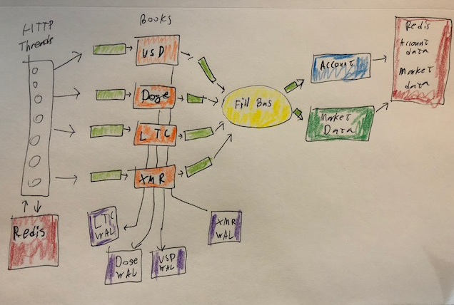

Welcome to Pepper Exchange this is a rough demo cryptocurrency exchange. 

### Directories ###

`cmd` contains the golang code for the backend api of the exchange
`scripts` contains bash used for testing
`vendor` contains golang dependencies
`web` contains the reactjs frontend

### Components ###

Golang executable `exchange`
Redis Server with no authentication configured
React frontend

### Setup ###
Start redis running locally with no authentication, ex on mac `brew install redis` => `redis-server`.
Redis running on `localhost:6379` 
Go to `cmd/exchange` and run the binary `./exchange` to start the golang server.
Go to `web` and run `npm install`, `npm start` to boot up the webserver

### Postman ###
There are postman tests in Pepper_Exchange.postman_colleciton.json for the 5 endpoints we have.
Health
Submit Order
Cancel Order
Market Data
Account Status

### Architecture ###

Glossary:
Orderbook/Matching Engine   A binary tree data structure and goroutine combined into a single struct.
FillBus 					A message bus
WAL							Write ahead log, used for durability
MarketData					A goroutine that pushes latest prices into redis
AccountResolver				A goroutine update portfolio state and pushes it to redis.
Redis						A high speed data structure store / cache

The exchange relies on goroutines and gochannels to coordinate state and avoid locks. There is an orderbook for each coin pair that we support, namely BTC/USD, BTC/LTC, BTC/DOGE, BTC/XMR. Each orderbook is protected by a goroutine that only accepts communication over a channel. This should allow the orderbooks to operate in a single threaded state with minimal locks, resulting in quick operation for the matching engine. 

The matching engine triggers only when an order is sent to the orderbook. We walk the red-black tree which represents the orderbook and make as many fills as possible. Once the order cannot make any further matches we either delete it or add it to the book. 

The orderbook itself is represented as a red-black binary search tree sorted by price in bitcoin/satoshi. This lets us walk the tree from the left or right for bids and asks respectively. 

Nodes are not deleted from the binary search tree at the moment, its probably a good idea to do so for nodes that have no outstanding orders. Presumably after a lot of use and price drifts the tree will accumulate unused nodes. 

Once the matching engine finishes walking the tree for matches and places the outstanding order on the tree, it dispatches a number of fills to the write ahead log and the FillBus. The write ahead log is a file on disk of all fills which can be used to reproduce state. In retrospect, it would have made more sense to create a write ahead log of Orders, because then we could simply feed them into the matching engine to recreate state when restarting the exchange. 

The FillBus is a message bus which sends fills out to subscribers. The extant subscribers are the `AccountResolver` and `MarketData` goroutines. These goroutines consume fills from the matching engine and use it to keep track of user balances and market conditions. The data they create is saved to Redis and consumed in HTTP read operations later. There is a bit of cross-redis coupling between the two when we calculate the total value in bitcoin of a portfolio. To calculate the portfolio value we need to get the exchange rates out of redis. 

Data flow is unidirectional through the Orderbook and into Redis. Reads are served out of Redis exclusivly, order submissions involve an account check which hits redis, and then are submitted to the orderbook input channel. 

